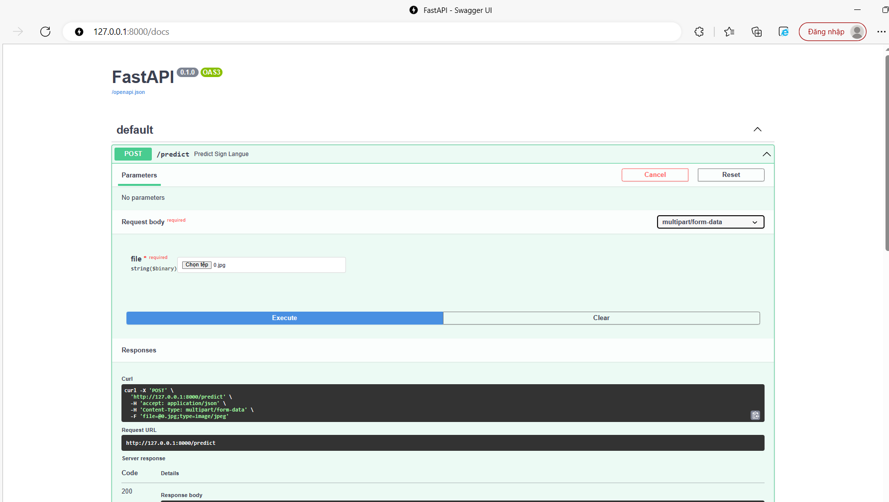

# Sign-Language-Api
README for running the Sign Language Prediction App

This app allows you to predict sign language letters from an image file.

Requirements:
To run this app, you will need:

Python 3.6 or higher

FastAPI

OpenCV (cv2)

Numpy

Keras

Installation:

Install Python: https://www.python.org/downloads/

Install the required Python packages by running the following command in your terminal or command prompt:

        pip install fastapi opencv-python numpy keras
        
Download the trained model file (sign-language.h5) and save it in the same directory as api.py.

Usage:

Open a terminal or command prompt and navigate to the directory containing api.py.

Run the following command:
    
    uvicorn main:app --reload
    
Open a web browser and go to http://localhost:8000/docs.

In the "POST /predict" section, click the "Try it out" button.

Select an image file to upload and click the "Execute" button.

The predicted sign language letter will be displayed in the "Response body" section.
